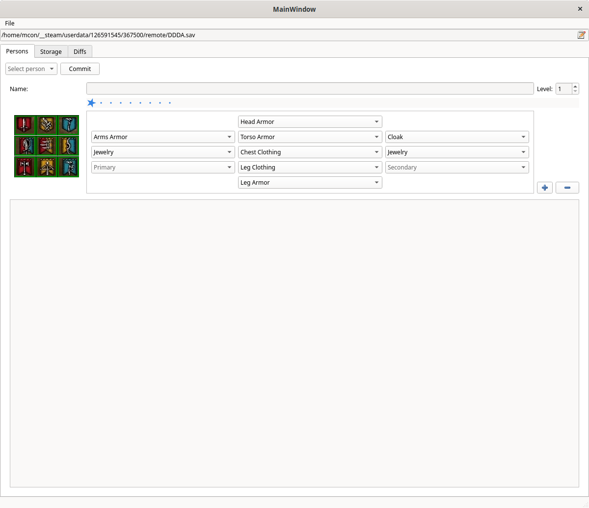
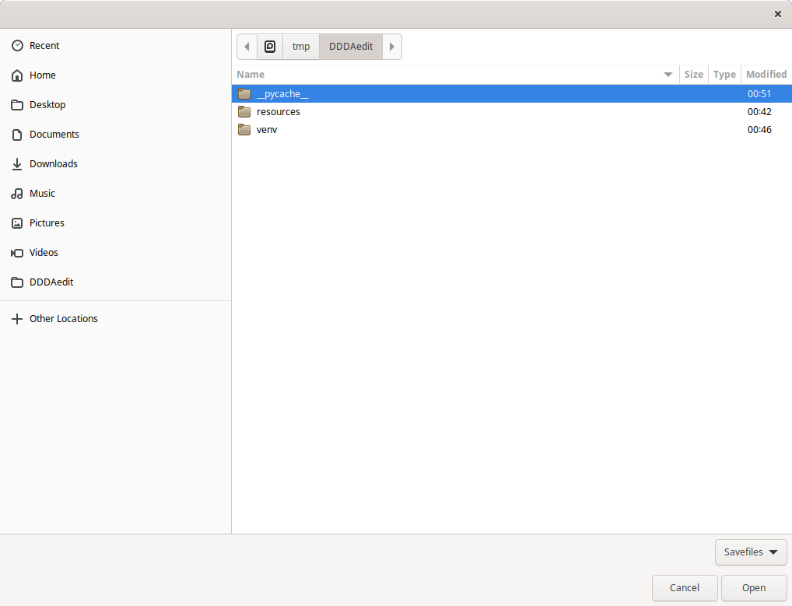
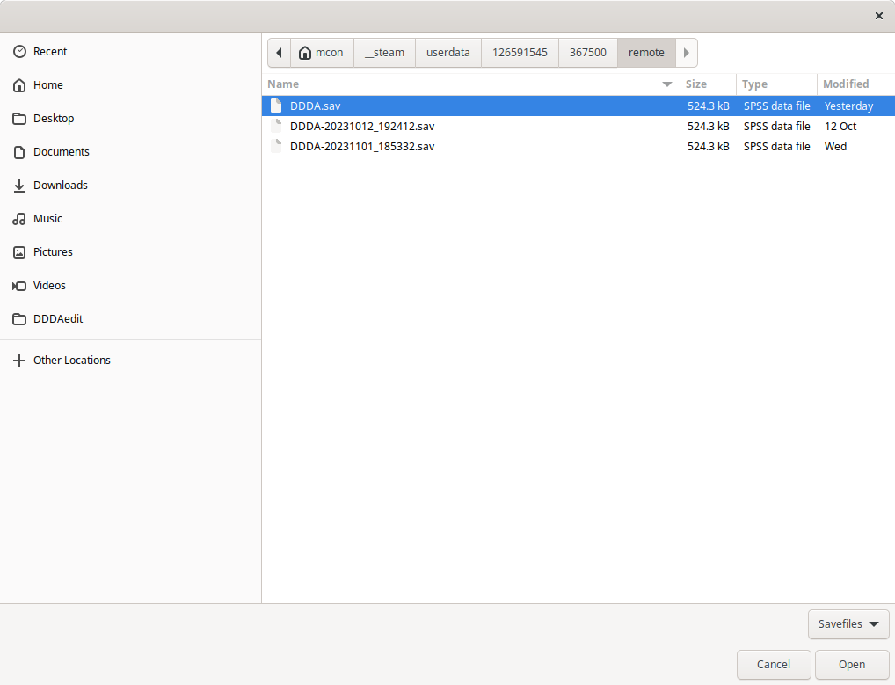
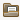

# Purpose
This project is my attempt to edit Dragon's Dogma Dark Arisen Sevefile (DDDA.sav).

I am playing the game via Steam's Proton under Linux, and I was unable to use the "standard" 
editor [3xDAsav](https://www.nexusmods.com/dragonsdogma/mods/531).

I took this opportunity to learn some Python/PyQt6 programming.

The present program is a complete rewrite in pure Python, but I owe greatly to those who
reverse engieered the save file; special menton goes to Dugarr anf Fluffyquack.

# Installation
The program is composed by two separate projects: 
- [ScreapeFandom](https://github.com/mcondarelli/ScrapeFandom) downloads images and descriptions from 
  [Fandom](https://dragonsdogma.fandom.com/wiki) site and convert them to a format suitable for use 
  with the other program.
- [DDDAedit](https://github.com/mcondarelli/DDDAedit) which is the currrent, still incomplete, editor.

Installation under Linux is straightforward:
- Clone the repository
  ```bash
  git clone https://github.com/mcondarelli/DDDAedit
  cd DDDAedit
  ```
- Prepare Virtual ENVironment (assuming you have Python3.9+ already installed, of course):
  ```bash
  python3 -m venv venv
  venv/bin/pip install -U pip wheel setuptools
  venv/bin/pip install -r requirements.txt
  ```
- Run the program:
  ```bash
  venv/bin/python DDDAedit.py
  ```

# Usage
Program should display something like:



The top LineEdit contains the full path to your installation Savefile.

You can edit it directly or browse the files by clicking on the  
icon on the right side;

It should open a FileOpenDialog like this:

You can use it to select your Savefile (or a copy of it): 

You can then load the file either via menu (`File -> Open...`) or clicking on the new 
 icon on the right of the filename.

At this point data is loaded and you can select a "Person" to edit.